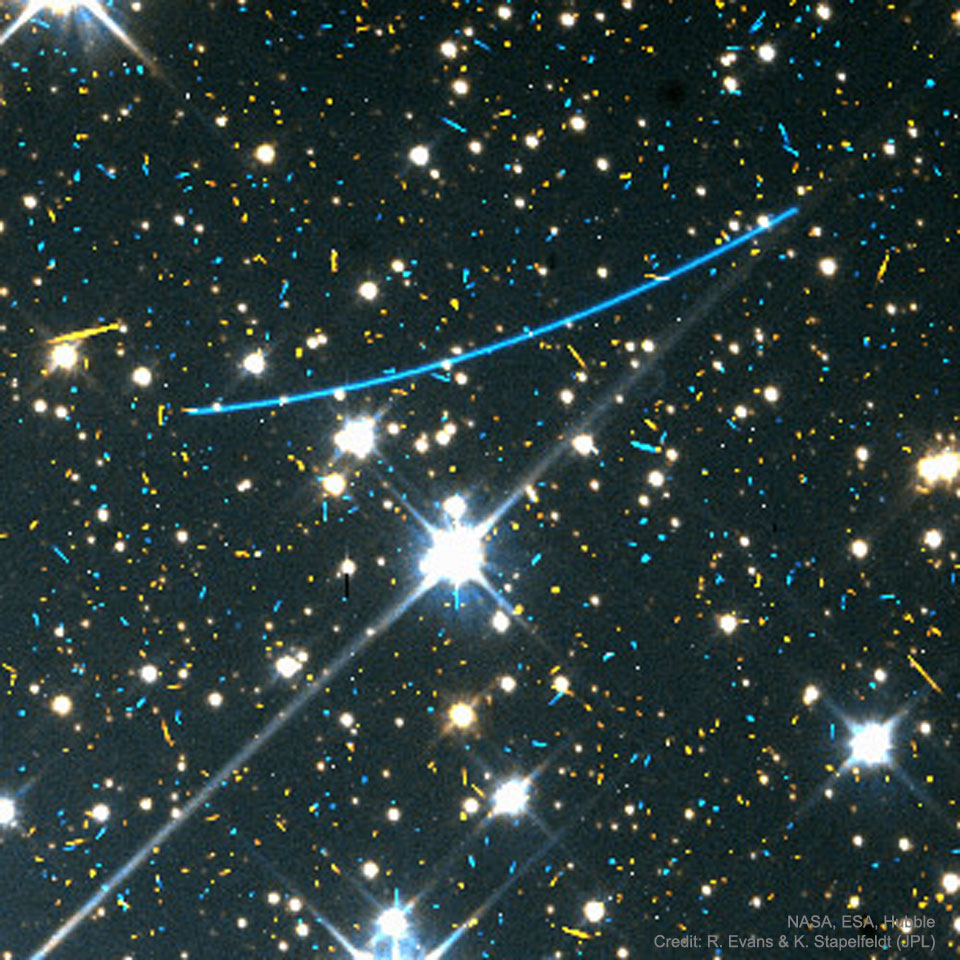

## space_data

This is a simple notebook put together for a demonstration of how to use the NASA APIs to get hold of space data.

To get access to NASA data it's recommended to get an API key from here:

  https://api.nasa.gov
  
Lots of nice data available and easy to get to!

